# Implementation of Seam Carving
Project for CS766 (Computer Vision), Spring 2018 UW-Madison

## Team Members
- Shuo Sun, ssun99@wisc.edu
- Shilu Zhang, szhang256@wisc.edu

## Project Proposal
[Link to Google Doc](https://docs.google.com/document/d/1z0z4b6yVGYcPRXuUE_9kr-a2so3J8vSAw8htgIIx6CU/edit?usp=sharing)

## MidTerm Report
[Link to PDF](MidTermReport.pdf)

## Introduction
The problem that our group is trying to focus on is image retargeting/content-aware image resizing. It is an important concern when we want to remove unused space from images, or add extra contents, but keep the main objects at their original aspects. Generally speaking, there are three guidelines that we need to follow when we try to resize/retarget an image:
- preserve important content of original media
- limit visual artifacts in resulting media
- preserve internal structures of original media

Seams, by definition, are the least-important connected pixels in an image. Therefore it comes intuitively that they are the things that we try to remove first when we want to remove unwanted contents from an image. So we choose the topic of seam carving, which is proposed by [Avidan & Shamir 07](http://www.faculty.idc.ac.il/arik/SCWeb/imret/) and improved by [Rubinstein, Shamir & Avidan 08](http://www.faculty.idc.ac.il/Arik/SCWeb/vidret/index.html), as the main focus for our project.

## Current state-of-the-art
Besides seam carving, there are many different approaches for content-aware image resizing. Among them are scale-and-stretch warping method by [Wang et al. 2008](https://dl.acm.org/citation.cfm?id=1409071), shift-map by [Pritch et al. 2009](https://pdfs.semanticscholar.org/38fd/97e5bd9ae77ee6d9245fad88a18385539691.pdf), and multi-operator by [Rubinstein et al. 2009](ftp://194.153.101.105/Faculty/Arik_Shamir/SCweb/multiop/multiop-lowres.pdf). There is a paper that summarizes all these different methods: A Comparative Study of Image Retargeting by [Rubinstein et al. 2009](https://people.csail.mit.edu/mrub/papers/retBenchmark.pdf). There is also a website dedicated to running image retargeting related benchmark programs called [RetargetMe](http://people.csail.mit.edu/mrub/retargetme/).

## Our approach
We adapt our major approach from [Avidan & Shamir 07](http://www.faculty.idc.ac.il/arik/SCWeb/imret/).
- Given an image I, we can calculate its energy by

<html>
<body>

    

        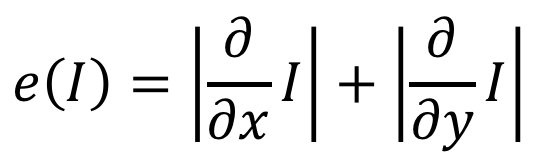
        
Original Input

    

</body>
</html>

- then we use dynamic programming to trace back from the last line of the image to the first line to calculate the minimum energy matrix M
<html>
<body>

    

        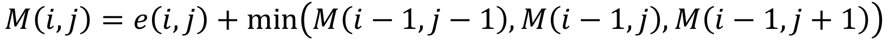
        
Original Input

    

</body>
</html>

- and finally, we can find the optimal seam to remove by
<html>
<body>

    

        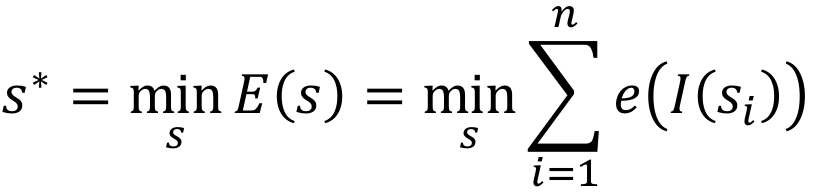
        
Original Input

    

</body>
</html>

## Results
### 1. Aspect ratio change
We can successfully apply the algorithm to reduce the width of an image to a target size. Figure 1 shows the result of reducing the width of the image by 100 pixels.

<html>
<body>
<table class="image">
<tr><td></td><td>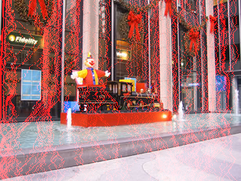</td><td>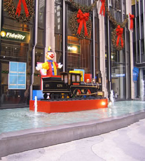</td></tr>
<tr><td class="caption">(a) Original Input</td><td class="caption">(b) Original Input with vertial seams</td><td class="caption">(c) Seam Carving</td></tr>
</table>
</body>
</html>

### 2. Retargeting with Optimal Seams-Order
When we try to fit the image to a new size, the order of removing seams may matter, especially when both horizontal and vertical seams are included. Optimal order reflects the most energy-efficient way when that happens.

<html>
<body>

    

        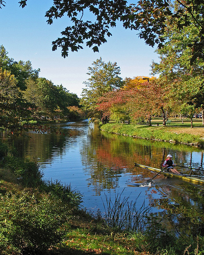
        
Original Input

    

<table class="image">
<tr><td>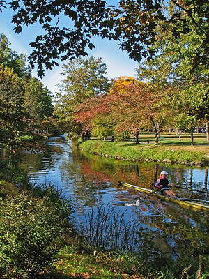</td><td>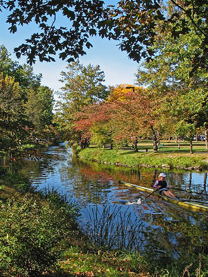</td><td>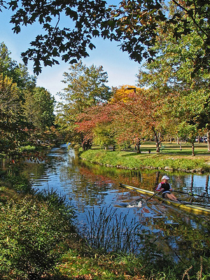</td><td></td></tr>
<tr><td class="caption">(a) horizontal then vertical</td><td class="caption">(b)  vertical then horizontal</td><td class="caption">(c) alternate between horizontal and vertical</td><td class="caption">(d) optimal order retargeting</td></tr>
</table>
</body>
</html>

### 3. Image Enlarging
We can also enlarge an image through seam carving. To achieve that purpose we need to calculate the seams that we are trying to remove first, then add these seams back to the original image. [img credit](https://raw.githubusercontent.com/vivianhylee/seam-carving/master/example/image6.jpg)

<html>
<body>
<table class="image">
<tr><td></td><td>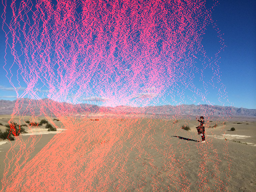</td><td>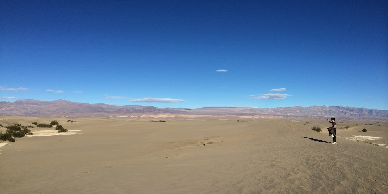</td></tr>
<tr><td class="caption">(a) Original Input</td><td class="caption">(b) Calculate seams</td><td class="caption">(c) Add to original image</td></tr>
</table>
</body>
</html>

### 4. Content Amplification
Sometimes we want to amplify certain contents of an image. We can first use standard scaling to enlarge the image and then apply seam carving on the larger image to carve the image back to its original size.

<html>
<body>
<table class="image">
<tr><td>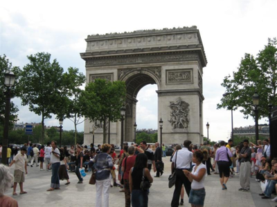</td><td></td><td>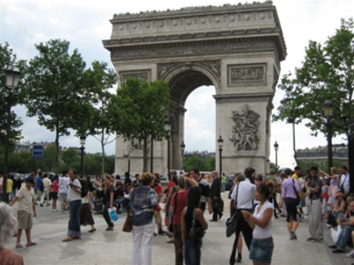</td></tr>
<tr><td class="caption">(a) Original Input</td><td class="caption">(b) Resizing</td><td class="caption">(c) Seam Carving</td></tr>
</table>
</body>
</html>

### 5. Object Removal
We mask the target object to be removed, the woman in green, and a region to project (red), seams are removed from the image until all marked pixels are gone. The system calculates the smaller of the vertical or horizontal diameters of the target removal regions and perform vertical or horizontal removals accordingly.

<html>
<body>
<table class="image">
<tr><td>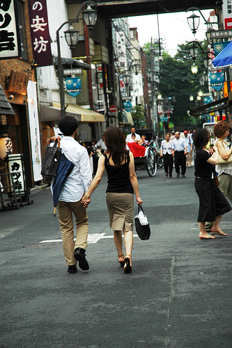</td><td>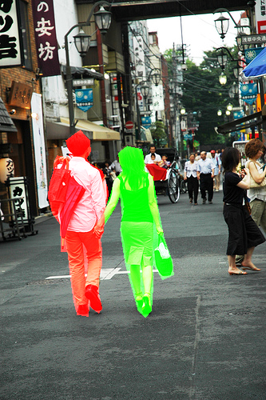</td><td>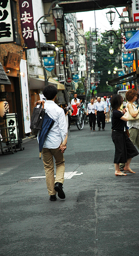</td></tr>
<tr><td class="caption">(a) Original Input</td><td class="caption">(b) Mask</td><td class="caption">(c) Object Removed</td></tr>
</table>
</body>
</html>

### 6. Object Removal and Resize
We removed the girl from the image by removing vertical seams and recorded all the coordinates and insert new seams in the same order at the recorded coordinates location of removal to regain the original size of the image.

<html>
<body>
<table class="image">
<tr><td>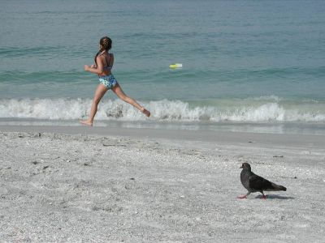</td><td>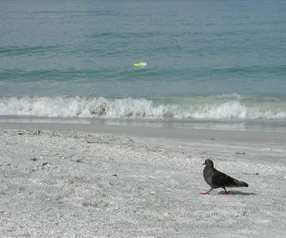</td><td>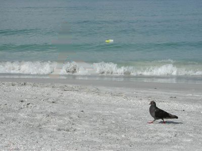</td></tr>
<tr><td class="caption">(a) Original Input</td><td class="caption">(b) Girl Removed</td><td class="caption">(c) Girl Removed and Resized</td></tr>
</table>
</body>
</html>

### 7. Forward Energy vs Backward Energy

The original algorithm using Backward Energy choose to remove seams with the least amount of energy from the image, ignoring energy that are inserted into the retargeted image. The new algorithm in the Rubinstein et al paper looks forward at the resulting image and searches for the seam whose removal inserts the minimal amount of energy into the image.
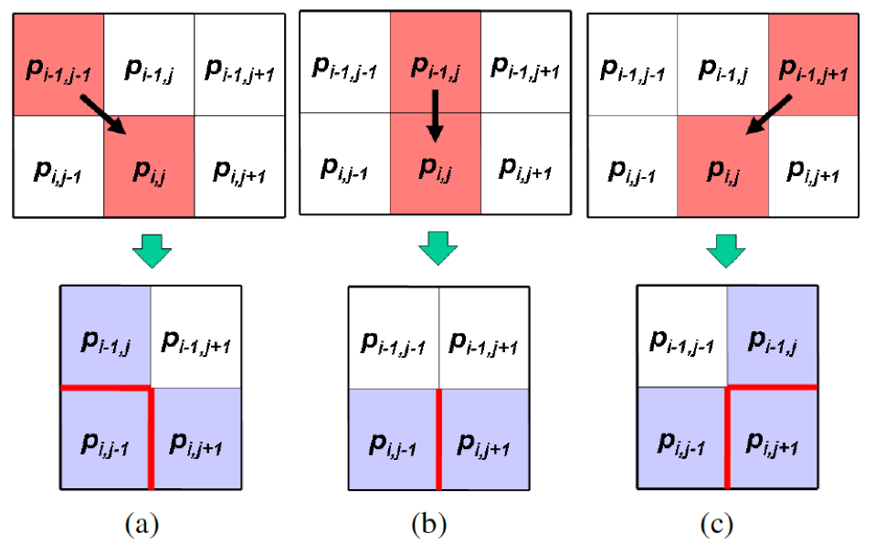

The cost is measured as forward differences between the pixels that become new neighbors. We use these costs in a new accumulative cost matrix M to calculate the seams using dynamic programming. Here is the formula for vertical seams. P(i, j) is an additional pixel based energy measure.

Here is an comparison between the original seam carving backward energy (middle) and the new forward energy (right) for resizing an image. The new results suffer much less from the artifacts generated using backward energy such as the difference in water color and the distortions of the bench bars and skeleton.

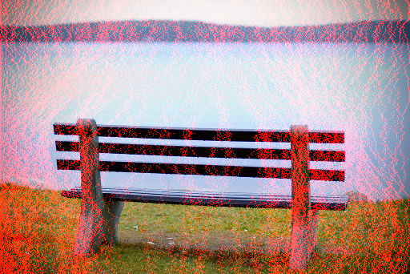
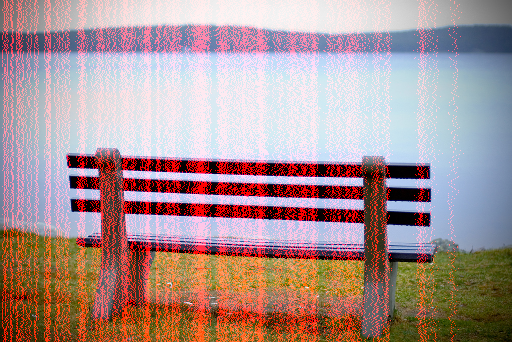

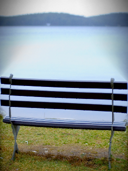

### 8. Simple Video Seam Carving

Next, we apply seam carving to videos. We search for regions in the image plane that are of low importance in all video frames. We compute the energy function on every image independently and then take the maximum energy value at each pixel location, thus reducing the problem back to image retargeting problem. Given a video sequence,  we extend the spatial L1-norm to a spatiotemporal L1-norm. alpha balances spatial and temporal contribution.

## Discussion
The main limitations of seam carving as a resizing method is that it does not work automatically on all images. Two major factors that limit the seam carving approach are amount of content in an image and the layout of the image content. 1) If the image is too condensed, in the sense that it does not contain 'less important' areas, then any type of content-aware resizing strategy will not succeed. 2) In certain types of images, albeit not being condensed, the content is laid out in a manner that prevents the seams from bypassing important parts.  It’s better to use scaling in these cases.
