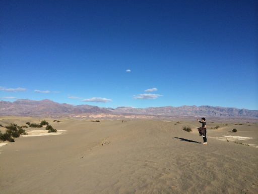

# Implementation of Seam Carving
Project for CS766 (Computer Vision), Spring 2018 UW-Madison

## Team Members
- Shuo Sun, ssun99@wisc.edu
- Shilu Zhang, szhang256@wisc.edu

## Project Proposal
[Link to Google Doc](https://docs.google.com/document/d/1z0z4b6yVGYcPRXuUE_9kr-a2so3J8vSAw8htgIIx6CU/edit?usp=sharing)

## Results
### 1. Aspect ratio change

### 2. Retargeting with Optimal Seams-Order

### 3. Image Enlarging

### 4. Content Amplification

### 5. Object Removal
We mask the target object to be removed, the woman in green, and a region to project (red), seams are removed from the image until all marked pixels are gone. The system calculates the smaller of the vertical or horizontal diameters of the target removal regions and perform vertical or horizontal removals accordingly.

### 6. Object Removal and Resize
We removed the girl from the image by removing vertical seams and recorded all the coordinates and insert new seams in the same order at the recorded coordinates location of removal to regain the original size of the image.

### 7. Forward Energy vs Backward Energy

The original algorithm using Backward Energy choose to remove seams with the least amount of energy from the image, ignoring energy that are inserted into the retargeted image. The new algorithm in the Rubinstein et al paper looks forward at the resulting image and searchs for the seam whose removal inserts the minimal amount of energy into the image. 

The cost is measured as forward differences between the pixels that become new neighbors. We use these costs in a new accumulative cost matrix M to calculate the seams using dynamic programming. Here is the formula for vertical seams. P(i, j) is an additional pixel based energy measure.

Here is an comparison between the original seam carving backward energy (middle) and the new forward energy (right) for resizing an image. The new results suffer much less from the artifacts generated using backward energy such as the difference in water color and the distortions of the bench bars and skeleton.

### 8. Simple Video Seam Carving

Next, we apply seam carving to videos. We search for regions in the image plane that are of low importance in all video frames. We compute the energy function on every image independently and then take the maximum energy value at each pixel location, thus reducing the problem back to image retargeting problem. Given a video sequence,  we extend the spatial L1-norm to a spatiotemporal L1-norm. alpha balances spatial and temporal contribution. 

## Discussion
