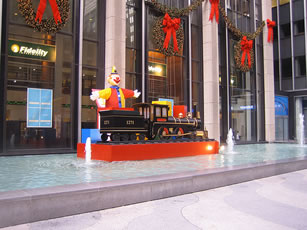

# Implementation of Seam Carving
Project for CS766 (Computer Vision), Spring 2018 UW-Madison

## Team Members
- Shuo Sun, ssun99@wisc.edu
- Shilu Zhang, szhang256@wisc.edu

[Proposal](https://docs.google.com/document/d/1z0z4b6yVGYcPRXuUE_9kr-a2so3J8vSAw8htgIIx6CU/edit?usp=sharing)

[Midterm Report](MidTermReport.pdf)

## Introduction
The problem that our group is trying to focus on is image retargeting/content-aware image resizing. It is an important concern when we want to remove unused space from images, or add extra contents, but keep the main objects at their original aspects. Generally speaking, there are three guidelines that we need to follow when we try to resize/retarget an image:
- preserve important content of original media
- limit visual artifacts in resulting media
- preserve internal structures of original media

Seams, by definition, are the least-important connected pixels in an image. Therefore it comes intuitively that they are the things that we try to remove first when we want to remove unwanted contents from an image. So we choose the topic of seam carving, which is proposed by [Avidan & Shamir 07](http://www.faculty.idc.ac.il/arik/SCWeb/imret/) and improved by [Rubinstein, Shamir & Avidan 08](http://www.faculty.idc.ac.il/Arik/SCWeb/vidret/index.html), as the main focus for our project.

## Current state-of-the-art
Besides seam carving, there are many different approaches for content-aware image resizing. Among them are scale-and-stretch warping method by [Wang et al. 2008](https://dl.acm.org/citation.cfm?id=1409071), shift-map by [Pritch et al. 2009](https://pdfs.semanticscholar.org/38fd/97e5bd9ae77ee6d9245fad88a18385539691.pdf), and multi-operator by [Rubinstein et al. 2009](ftp://194.153.101.105/Faculty/Arik_Shamir/SCweb/multiop/multiop-lowres.pdf). There is a paper that summarizes all these different methods: A Comparative Study of Image Retargeting by [Rubinstein et al. 2009](https://people.csail.mit.edu/mrub/papers/retBenchmark.pdf). There is also a website dedicated to running image retargeting related benchmark programs called [RetargetMe](http://people.csail.mit.edu/mrub/retargetme/).

## Our approach
We adapt our major approach from [Avidan & Shamir 07](http://www.faculty.idc.ac.il/arik/SCWeb/imret/).
- Given an image I, we can calculate its energy by
<html>
<body>

    

        
    

</body>
</html>

- then we use dynamic programming to trace back from the last line of the image to the first line to calculate the minimum energy matrix M
<html>
<body>

    

        
    

</body>
</html>

- and finally, we can find the optimal seam to remove by
<html>
<body>

    

        
    

</body>
</html>

## Results
### 1. Aspect ratio change
We can successfully apply the algorithm to reduce the width of an image to a target size. Figure 1 shows the result of reducing the width of the image by 100 pixels.

<html>
<body>
<table class="image">
<tr><td></td><td></td><td></td></tr>
<tr><td class="caption">(a) Original Input</td><td class="caption">(b) Original Input with vertial seams</td><td class="caption">(c) Seam Carving</td></tr>
</table>
    <figcaption>Figure 1: Result of seam carving to reduce an image</figcaption>
</body>
</html>

### 2. Retargeting with Optimal Seams-Order
When we try to fit the image to a new size, the order of removing seams may matter, especially when both horizontal and vertical seams are included. Optimal order reflects the most energy-efficient way when that happens.

<html>
<body>

    

        
        
Original Input

    

<table class="image">
<tr><td></td><td></td><td></td><td></td></tr>
<tr><td class="caption">(a) horizontal then vertical</td><td class="caption">(b)  vertical then horizontal</td><td class="caption">(c) alternate between horizontal and vertical</td><td class="caption">(d) optimal order retargeting</td></tr>
</table>
    <figcaption>Figure 2: Result of retargeting image with optimal seams-order using seam carving</figcaption>
</body>
</html>

### 3. Image Enlarging
We can also enlarge an image through seam carving. To achieve that purpose we need to calculate the seams that we are trying to remove first, then add these seams back to the original image. [img credit](https://raw.githubusercontent.com/vivianhylee/seam-carving/master/example/image6.jpg)

<html>
<body>
<table class="image">
<tr><td></td><td></td><td></td></tr>
<tr><td class="caption">(a) Original Input</td><td class="caption">(b) Calculate seams</td><td class="caption">(c) Add to original image</td></tr>
</table>
    <figcaption>Figure 3: Result of image enlarging using seam carving</figcaption>
</body>
</html>

### 4. Content Amplification
Sometimes we want to amplify certain contents of an image. We can first use standard scaling to enlarge the image and then apply seam carving on the larger image to carve the image back to its original size.

<html>
<body>
<table class="image">
<tr><td></td><td></td><td></td></tr>
<tr><td class="caption">(a) Original Input</td><td class="caption">(b) Resizing</td><td class="caption">(c) Seam Carving</td></tr>
</table>
        <figcaption>Figure 4: Result of content amplification using seam carving</figcaption>
</body>
</html>

### 5. Object Removal
To remove a target object from an image, we first mask the target object to be removed (the woman in green), and a region to project (the man in red). Seams are removed from the image until all marked pixels are gone. The algorithm computes the smaller of the vertical or horizontal diameters of the target removal regions and perform vertical or horizontal removals accordingly.

<html>
<body>
<table class="image">
<tr><td></td><td></td><td></td></tr>
<tr><td class="caption">(a) Original Input</td><td class="caption">(b) Mask</td><td class="caption">(c) Object Removed</td></tr>
</table>
    <figcaption>Figure 5: Result of object removal using seam carving</figcaption>
</body>
</html>

### 6. Object Removal and Resize
Sometimes we want to resize the image to original size after removing a target object. Here we removed the girl from the image by removing vertical seams and recorded all the coordinates and insert new seams in the same order at the recorded coordinates location of removal to regain the original size of the image.

<html>
<body>
<table class="image">
<tr><td></td><td></td><td></td></tr>
<tr><td class="caption">(a) Original Input</td><td class="caption">(b) Girl Removed</td><td class="caption">(c) Girl Removed and Resized</td></tr>
</table>
    <figcaption>Figure 6: Result of object removal and resizing using seam carving</figcaption>
</body>
</html>

### 7. Forward Energy vs Backward Energy

The original algorithm using Backward Energy choose to remove seams with the least amount of energy from the image, ignoring energy that are inserted into the retargeted image. The new algorithm in the Rubinstein et al paper looks forward at the resulting image and searches for the seam whose removal inserts the minimal amount of energy into the image.

<html>
<body>

</body>
</html>

The cost is measured as forward differences between the pixels that become new neighbors. 
<html>
<body>

</body>
</html>
We use these costs in a new accumulative cost matrix M to calculate the seams using dynamic programming. Here is the formula for vertical seams:
<html>
<body>

</body>
</html>

Here is an comparison between the original seam carving backward energy (a) and the new forward energy (b) for resizing an image. The new results suffer much less from the artifacts generated using backward energy such as the distortions of the bench bars and skeleton.

<html>
<body>

    
<figcaption>Original Input</figcaption>

 
<table class="image">
<tr><td></td><td></td></tr>
<tr><td></td><td></td></tr>
<tr><td class="caption">(a) Backward Energy</td><td class="caption">(b) Forward Energy</td></tr>
</table>
    <figcaption>Figure 7: Comparison between backward energy and forward energy</figcaption>
</body>
</html>

### 8. Simple Video Seam Carving

Next, we apply seam carving to videos. We search for regions in the image plane that are of low importance in all video frames. We compute the energy function on every image independently and then take the maximum energy value at each pixel location, thus reducing the problem back to image retargeting problem. Given a video sequence,  we extend the spatial L1-norm to a spatiotemporal L1-norm as below:
<html>
<body>

</body>
</html>

<html>
<body>
<video src="Videos/golf.mp4" height="200" controls>
<video src="Videos/golf_reduced.mov" height="200" controls>
<video src="Videos/ratatouille1.mov" height="100" controls>
<video src="Video/ratatouille1_reduced1.mov" height="100"  controls>
<figcaption>Figure 8: Simple Video Seam Carving using the global energy approach</figcaption>
</body>
</html>

[(a) Original Input](https://github.com/Dennis-Sun/cvproject/blob/master/Videos/golf.mp4)
[(b) Seam Carving](https://github.com/Dennis-Sun/cvproject/blob/master/Videos/golf_reduced.mov)
[(a) Original Input](https://github.com/Dennis-Sun/cvproject/blob/master/Videos/ratatouille1.mov)
[(b) Seam Carving](https://github.com/Dennis-Sun/cvproject/blob/master/Videos/ratatouille1_reduced1.mov)

### 9. Graph Cut Seam Carving:
To improve the performance of seam carving to images and videos, we implemented the graph cut method proposed in the Rubinstein et al paper. To find the optimal seam, we need to construct a directed graph to represent the image. Using vertical seams as an example:

1) We first add a source node S to every pixel in the leftmost column with infinity weight and then add a sink node T to every pixel in the rightmost column of the image. 

2) For forward edges, we add the edges along with their weight as shown in Figure 9, +LR=|I(i,j+1)-I(i,j-1)|, +LU=|I(i-1,j)-I(i,j-1)|, -LU=|I(i+1,j)-I(i,j-1)|.

3) Then, we will apply the min-cut alogrithm to partition the graph into two disjoint subsets S and T. The optimal seam is defined by the optimal cut from S to T. 

Figure 10 is shown the result after removing 50 pixels from the orignal image using graph cut seam carving.

<html>
<body>

<figcaption>Figure 9: Forward Energy graph connections for vertical seam</figcaption>
</body>
</html>

<html>
<body>
<table class="image">
<tr><td></td><td></tr>
<tr><td class="caption">(a) Original Input</td><td class="caption">(b)Seam Carving Using Graph Cut</td></tr>
</table>
     <figcaption>Figure 10: Result of reducing size an image using graph cuts method</figcaption>
</body>
</html>

### 10. Comparisons with other approaches:
We compare seam carving with cropping and standard image scaling. Figure 11 is shown the original image and resized images using different approaches. We can see that cropping only remove pixels from the image periphery. Standard image scaling is not sufficient because it is oblivious to the image content and reduces the content of the original image. Seam carving achieves better results than cropping and standard image scaling as it considers the image content. 

<html>
<body>
<table class="image">
<tr><td></td><td></td></tr>
<tr><td class="caption">(a) Original Input</td><td class="caption">(b)Cropping</td></tr>
<tr><td></td><td></td></tr>
<tr><td class="caption">(c) Standard Scaling</td><td class="caption">(d) Seam Carving</td></tr>
</table>
    <figcaption>Figure 11: Comparisons of seam carving with cropping and standard image scaling</figcaption>
</body>
</html>

## Discussion 
### Limitations:
The main limitation of seam carving as a resizing method is that it does not work automatically on all images. Two major factors that limit the seam carving approach are amount of content in an image and the layout of the image content. 

1) If the image is too condensed, it does not contain 'less important' areas which can be removed. Thus, the content-aware resizing strategy such as seam carving will not work. 

2) Although some images are not condensed, the content of the image is laid out in a manner that prevents the seams from bypassing important parts. In this second case, seam carving will not succeed as well.

It’s better to use standard scaling in these two cases.

### Future Work:
There are some extensitions to this work. 
1) We would like to apply seam carving using graph cuts to videos as it could remove  serious artifacts that are caused by applying seam carving separately to each frame of the video. 
2) We also want to apply seam carving for multi-size images, where we don't have the target sizes ahead of time. For example, the image embedded in a web page.

## References:
1. RUBINSTEIN, M., GUTIERREZ, D., SORKINE, O., SHAMIR, A. 2010. A comparative study of image retargeting. In: SIGGRAPH Asia.
2. PRITCH, Y., KAV-VENAKI, E., AND PELEG, S. 2009. Shift-map image editing. In ICCV, 151–158.
3. WANG, Y.-S., TAI, C.-L., SORKINE, O., AND LEE, T.-Y. 2008. Optimized scale-and-stretch for image resizing. ACM TOG 27, 5.
4. LIU, F., AND GLEICHER, M. 2005. Automatic Image Retargeting with Fisheye-View Warping. In ACM UIST, 153-162.
5. SETLUR, V., TAKAGI, S., RASKAR, R., GLEICHER, M., AND GOOCH, B. 2005. Automatic Image Retargeting. In In the Mobile and Ubiquitous Multimedia (MUM), ACM Press.

