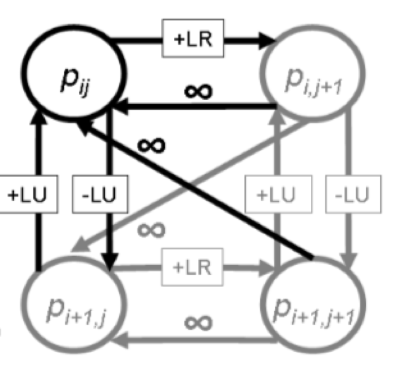

### Graph Cut Seam Carving:
To improve the performance of seam carving to images and videos, we implemented the graph cut method proposed in the Rubinstein et al paper. To find the optimal seam, we need to construct a directed graph to represent the image. Using vertical seams as an example:

1) We first add a source node S to every pixel in the leftmost column with infinity weight and then add a sink node T to every pixel in the rightmost column of the image. 

2) For forward edges, we add the edges along with their weight as shown in Figure 10, +LR=|I(i,j+1)-I(i,j-1)|, +LU=|I(i-1,j)-I(i,j-1)|, -LU=|I(i+1,j)-I(i,j-1)|.

3) Then, we will apply the min-cut alogrithm to partition the graph into two disjoint subsets S and T. The optimal seam is defined by the optimal cut from S to T. 

Figure 11 is shown the result after removing 50 pixels from the orignal image using graph cut seam carving.

<figcaption>Fig10. Forward Energy graph connections for vertical seam</figcaption>

<html>
<body>
<table class="image">
<tr><td></td><td></tr>
<tr><td class="caption">Figure 11(a) Original Input</td><td class="caption">(b)Seam Carving Using Graph Cut</td></tr>
</table>
</body>
</html>

### Comparisons with other approaches
We compare seam carving with cropping and standard image scaling. Figure 12 is shown the original image and resized images using different approaches. We can see that cropping only remove pixels from the image periphery. Standard image scaling is not sufficient because it is oblivious to the image content and reduces the content of the original image. Seam carving achieves better results than cropping and standard image scaling as it considers the image content. 

<html>
<body>
<table class="image">
<tr><td></td><td></td></tr>
<tr><td class="caption">Figure 12(a) Original Input</td><td class="caption">(b)Cropping</td></tr>
<tr><td></td><td></td></tr>
<tr><td class="caption">(c) Standard Scaling</td><td class="caption">(d) Seam Carving</td></tr>
</table>
</body>
</html>
