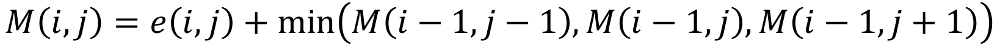

# Introduction
The problem that our group is trying to focus on is image retargeting/content-aware image resizing. It is an important concern when we want to remove unused space from images, or add extra contents, but keep the main objects at their original aspects. Generally speaking, there are three guidelines that we need to follow when we try to resize/retarget an image:
- preserve important content of original media
- limit visual artifacts in resulting media
- preserve internal structures of original media

Seams, by definition, are the least-important connected pixels in an image. Therefore it comes intuitively that they are the things that we try to remove first when we want to remove unwanted contents from an image. So we choose the topic of seam carving, which is proposed by [Avidan & Shamir 07] and improved by [Rubinstein, Shamir & Avidan 08], as the main focus for our project.

# Current state-of-the-art
Besides seam carving, there are many different approaches for content-aware image resizing. Among them are scale-and-stretch warping method by [Wang et al. 2008], shift-map by [Pritch et al. 2009], and multi-operator by [Rubinstein et al. 2009]. There is a paper that summarizes all these different methods: A Comparative Study of Image Retargeting by [Rubinstein et al. 2009]. There is also a website dedicated to running image retargeting related benchmark programs called [RetargetMe](http://people.csail.mit.edu/mrub/retargetme/).

# Our approach
We adapt our major approach from [Avidan & Shamir 07].
- Given an image I, we can calculate its energy by 

- then we use dynamic programming to trace back from the last line of the image to the first line to calculate the minimum energy matrix M 

- and finally, we can find the optimal seam to remove by 
